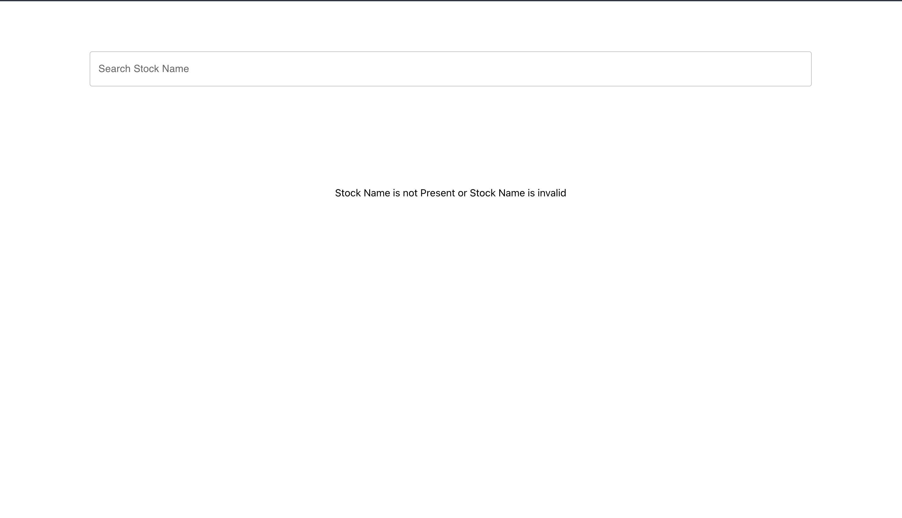
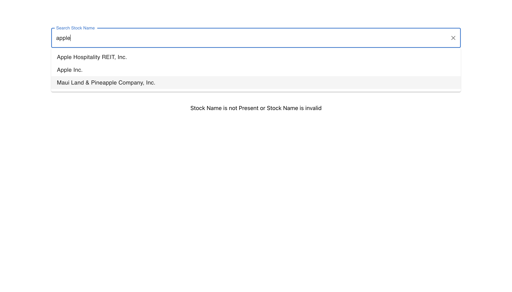
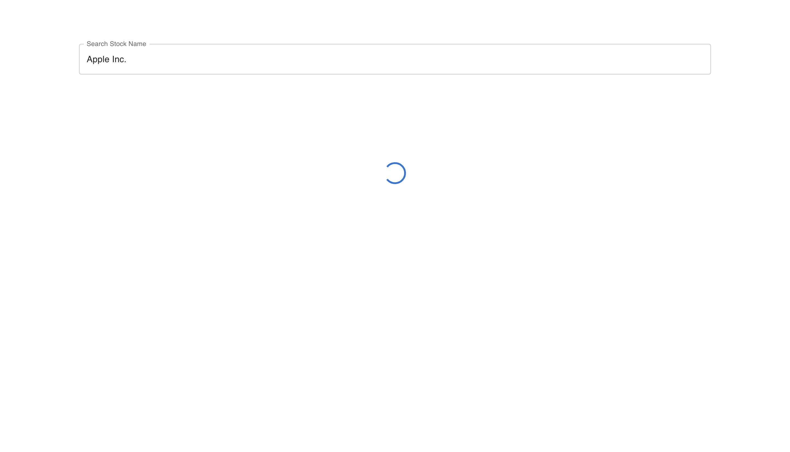
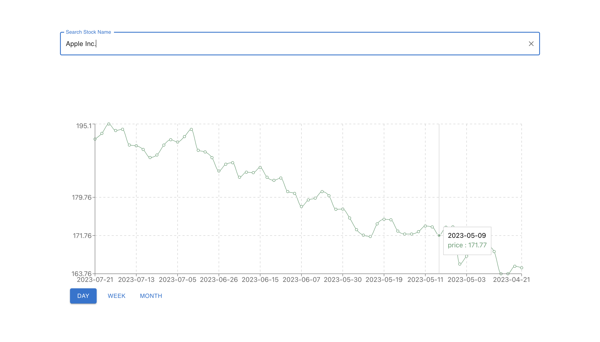
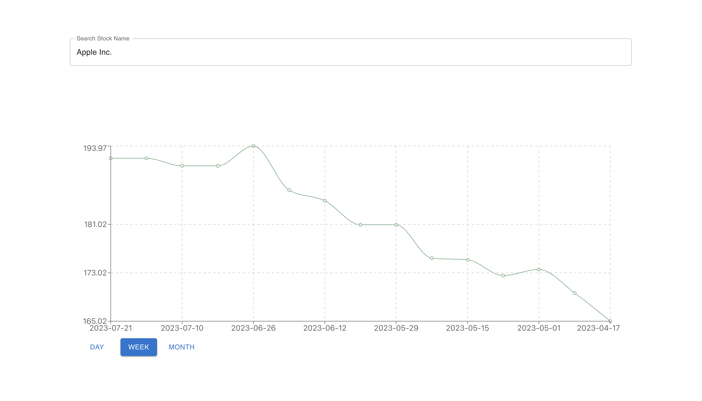
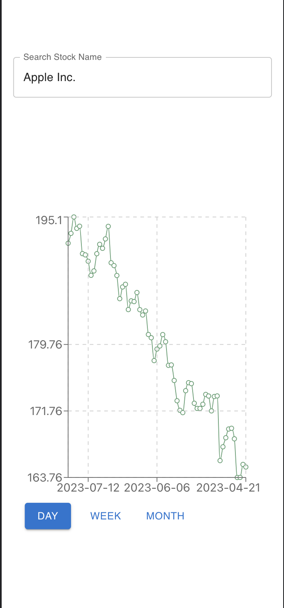

# Stock Chart Viewer

React-based Application for tracking Stock Day, Weekly, and Monthly movement. You can search stock directly by Name and Ticker.

## Tech Stack

### Frontend

-   Frontend: React, TypeScript, Material UI, ReCharts, Axios, and Lodash(Debouncer)
-   Backend: ExpressJs, Cors, Yahoo-finance.

## Folder Structure

There are 2 main folders: Frontend and Backend.

-   Frontend: Entry point index.tsx. The smallest atomic components are present in components folder and developing functional components are in the containers folder. Interfaces for arguments and Responses in types folder.

## Development Philosophy

1. Frontend

-   Reusable functional components with type checking using TypeScript.
-   Used React Context APIs for props passing and updating props state.
-   Responsive UI making it accessible from different devices.

2. Backend

-   ExpressJS for API development.
-   Functional business logic separated in service folder
-   CORS for different domain/Port Access
-   Express Router for easy development of different services which are scaled by different devs
-   Recommendation API for Autosuggestion
-   Search functionality based on Name and Ticker

## How to Run

1. Frontend setup

```
bash
cd frontend
npm install
npm start
```

2. Backend setup

```
bash
cd backend
npm install
node app.js
```

## Walkthrough

1. First View with an empty state
   

2. Recommendations when you start typing in the input box
   

3. Loading of Chart data after selection from recommendations
   

4. Daily Chart Data
   

5. Weekly Chart Data
   

6. Monthly Chart Data
   

7. Responsive Chart Data
   
